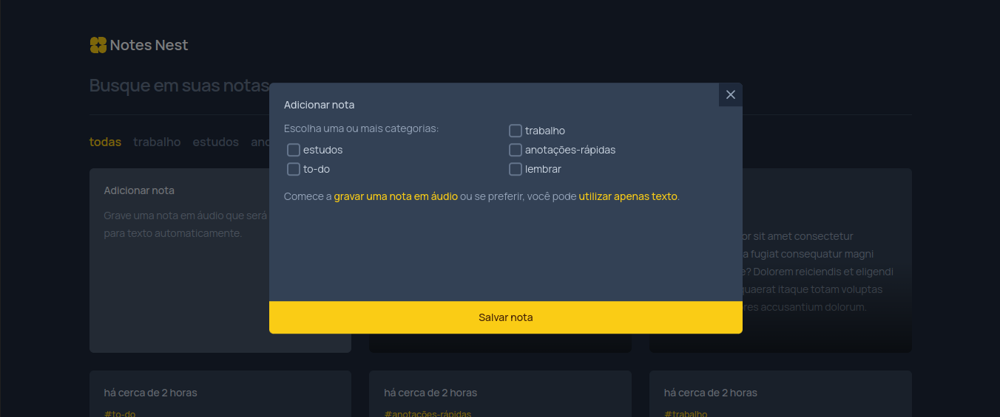

React + TypeScript + Vite + Tailwind
### Notes Nest

Aplicação para gerenciamento de notas.
Feito com _React, TypeScript, Tailwind, Radix UI, Vite_ e utilizada a _API SpeechRecognition_ para fazer **transcrição de áudio para texto**.

---
 

Criação de notas de texto, exclusão e filtragem por pesquisa e categoria. E opção de criação com transcrição de áudio.

 

---

🖱️ **Visite:** https://notesnest.vercel.app/
